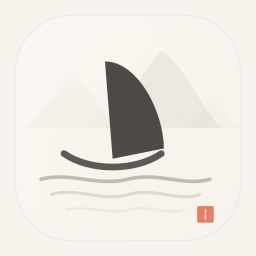

<div align="center">



# 轻舟 · QingZhou

**一款面向中文用户、原生 macOS 风格的 Mihomo 控制器**

[](./LICENSE)
[](#)
[](https://github.com/bh3hbr/QingZhou-App/releases/latest)
[](https://github.com/bh3hbr)

—— 两岸猿声啼不住，**轻舟**已过万重山

</div>

---

## 📖 简介

**轻舟（QingZhou）** 是一款完全使用 SwiftUI 打造的 macOS 原生 Mihomo 客户端，以更符合中文桌面审美的方式重构了传统代理工具的界面。

> [!NOTE]
> **关于开源**
>
> 当前项目尚处于打磨阶段，代码结构、模块边界与对外 API 仍在持续调整中，为避免早期接口反复变动给社区造成困扰，**暂不开源源代码**。
>
> 待项目逐步稳定、完成核心功能沉淀与必要的代码整理后，**将择机开放源码**，届时会在本仓库同步公告。感谢理解与耐心等待 🙏
>
> 当前阶段本仓库仅用于**分发已编译的安装包**，欢迎下载试用并通过 [Issues](https://github.com/bh3hbr/QingZhou-App/issues) 反馈问题。

---

## ⬇️ 下载安装

<div align="center">

### [⬇️ 前往 Releases 下载最新版](https://github.com/bh3hbr/QingZhou-App/releases/latest)

[](https://github.com/bh3hbr/QingZhou-App/releases/latest)
[](https://github.com/bh3hbr/QingZhou-App/releases)

</div>

| 版本 | 架构 | 系统要求 | 下载 |
|------|------|---------|------|
| **1.0.0** | Universal（Intel + Apple Silicon） | macOS 14+ | [📦 轻舟-1.0.0-universal.dmg](https://github.com/bh3hbr/QingZhou-App/releases/download/v1.0.0/%E8%BD%BB%E8%88%9F-1.0.0-universal.dmg) |

> 所有历史版本均可在 [Releases 页面](https://github.com/bh3hbr/QingZhou-App/releases) 获取。

### 安装步骤

1. 下载 `.dmg` 安装包
2. 双击打开，将 **轻舟.app** 拖入「应用程序」文件夹
3. 首次启动时，macOS 可能提示"无法打开"——这是因为当前版本使用 ad-hoc 签名，未走 Apple 公证。请按下述方式放行：

**方式一 · 访达右键打开（推荐）**

在「应用程序」中，对 **轻舟.app** 右键 → **打开** → 弹窗中再次点击 **打开**。

**方式二 · 终端命令**

```bash
xattr -dr com.apple.quarantine /Applications/轻舟.app
```

执行后双击即可正常启动。

---

## ✨ 功能一览

### 🎨 原生体验
- **SwiftUI + AppKit 双栈**，完全遵循 macOS 14+ 的设计语言
- **暖色玻璃卡片**、分栏结构与中文排版节奏
- **水墨意境品牌视觉**，帆船图标 + 远山意象 + 朱印点睛
- **MenuBarExtra 原生面板**，快速切换模式、查看速率、唤出主界面

### ⚙️ 核心管理
- 🧬 内置 Mihomo 核心：本地版本查询、远端版本检查、一键升级
- ▶️ 启动 / 停止 / 重启，运行状态实时反映
- 📊 内存占用监控
- 🌐 **系统代理接管**，通过 `networksetup` 开关，必要时走管理员授权链路
- 🚀 **开机启动** 基于 `SMAppService`

### 📂 配置集管理
- 📄 本地 **YAML / JSON** 文件导入导出
- 🔗 **订阅 URL** 导入、一键刷新、按周期自动后台刷新
- ✏️ 直接编辑配置内容

### 🔧 持久化与体验
- 💾 偏好设置自动保存到 `Application Support`
- 🎚️ 菜单栏速率显示、快速切换模式、开机启动、允许局域网连接全部可配置
- 📋 一键复制 **Bash / Zsh · Fish · PowerShell · Cmd** 代理环境变量

---

## 📸 截图预览

<div align="center">


<sub>设置页 —— 核心管理、偏好设置、系统代理、网络、环境变量一览</sub>

</div>

---

## ❓ 常见问题

**Q：为什么首次打开会提示"无法打开，因为无法验证开发者"？**

A：当前版本使用 ad-hoc 签名，未经过 Apple 公证服务。这不代表软件有问题，按上文「安装步骤」第 3 条放行即可。未来发布的版本会逐步补齐 Developer ID 签名与公证。

**Q：系统代理切换失败？**

A：切换系统代理需要调用 `networksetup`，macOS 会要求管理员授权。请在弹出的系统对话框中输入密码授权。

**Q：如何反馈问题或提建议？**

A：欢迎在 [Issues](https://github.com/bh3hbr/QingZhou-App/issues) 留言。

---

## 🙏 致谢

- [MetaCubeX / mihomo](https://github.com/MetaCubeX/mihomo) — 核心代理引擎
- 所有为中文原生 macOS 软件默默贡献的开发者

---

## 📜 许可证

本项目采用 [MIT License](./LICENSE)。

```
Copyright (c) 2026 BH3HBR
```

---

## 👤 作者

**BH3HBR**

- GitHub: [@bh3hbr](https://github.com/bh3hbr)
- 发布仓库: [bh3hbr/QingZhou-App](https://github.com/bh3hbr/QingZhou-App)

如果觉得这个项目对你有帮助，欢迎点一个 ⭐ Star 支持一下。
